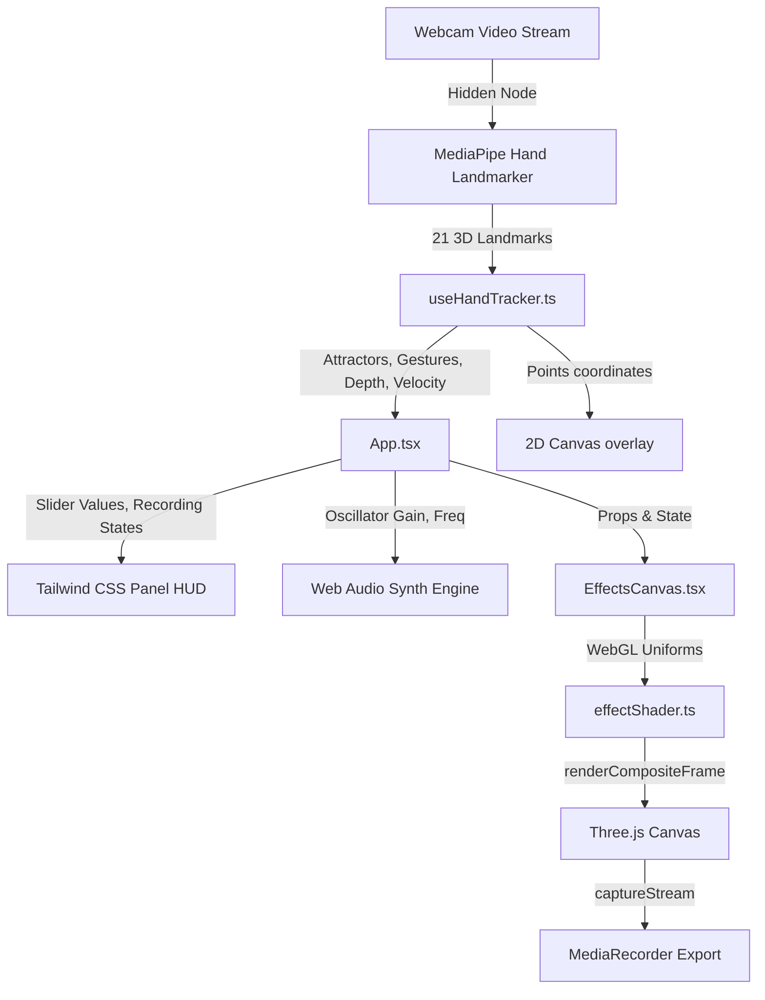

# ArcGesture Desktop Operator: Interactive Action Report & Spec

This report serves as the official user manual, architectural specification, and interaction checklist for the **ArcGesture Desktop Operator** application.

---

## 1. Step-by-Step Action Guide

Perform the following sequences in front of your webcam to test the full capability of the system:

### 🟩 Step 1: Initialize the Bounding Frame
*   **Action**: Raise both hands in front of the camera, palms facing the screen, fingers spread.
*   **Result**: The MediaPipe skeleton renders in silver joints. A glowing neon quadrilateral bounding frame snaps to your index fingertips and thumbs, tracking your movements.

### 🔄 Step 2: Cycle Through Visual Effects
*   **Action**: Bring your hand knuckles close together (knuckle clap distance $< 10\%$) and pull them apart.
*   **Result**: An audio pitch swoop plays, and the visual effect inside the lens cycles. Repeat to cycle through all 7 available modes (Particle, Burn, Silhouette, Thermal, Pixel, Glitch, Neon Edges).

### 🌀 Step 3: Swirl the Particle Flow Field
*   **Action**: Set the active lens to **Effect 0 (Particle Matrix)**. Move your index fingers around inside the quad.
*   **Result**: The grid particles warp and slide away from your fingertips, and the background image ripples dynamically behind your fingers like digital ink swirling in water.

### 🔊 Step 4: Trigger the Volumetric Depth Bass Hum
*   **Action**: Push both hands very close to the camera, then pull them far back.
*   **Result**: A continuous low low-pass hum plays. As your hands approach the camera, the hum shifts to a heavy bass rumble and the neon edge glow in the shader flares up (depth-reactive bloom).

### 🎛️ Step 5: Toggle the Holographic Settings Panel
*   **Action**: Move either hand into the right 15% width margin of the screen.
*   **Result**: A futuristic glassmorphism settings drawer slides in from the right edge, showing control sliders for speed, grain, and neon outlines.

### 🎚️ Step 6: Collide Finger with Settings Sliders
*   **Action**: Hover your index fingertip vertically over the sliders (Speed, Grain, Neon Glow) inside the panel.
*   **Result**: Bounding box coordinates collision triggers, updating the slider levels and adjusting the WebGL shader rendering speed, noise, or border glows in real-time.

### 💥 Step 7: Cast Refractive Pinch Shockwaves
*   **Action**: Pinch index finger and thumb of either hand together.
*   **Result**: Refractive shockwave glass ripples emanate outward from the pinch coordinates.

### 💀 Step 8: Trigger the X-Ray Scanner
*   **Action**: Pinch index finger and thumb of **both** hands simultaneously.
*   **Result**: The quad collapses into a thin horizontal strip, transitioning instantly to X-Ray mode (volume blue hues, Sobel cyan edges, film grain jitter, and scrolling scanlines).

### 📹 Step 9: Record & Export Your Performance
*   **Action**: Fold all fingers except your thumb, pointing it straight up (**Thumbs-Up** gesture).
*   **Result**: A green circular percentage loader fills up. When it hits 100%, a blinking red `REC` overlay appears. The app records the Three.js composite canvas for 5 seconds and triggers a WebM download.

---

## 2. Technical Features Manifest

| Feature | Behind-the-scenes Logic & Math | Visual / System Use |
| :--- | :--- | :--- |
| **Bilinear Quad Deformation** | $V(u,v) = (1-u)(1-v)bl + u(1-v)br + (1-u)v\,tl + uv\,tr$ | Warps a 32x32 plane geometry to form the dynamic bounding lens between hands. |
| **Bilinear Screen-Space UV** | $u_{screen} = \frac{vx + 1}{2}, \quad v_{screen} = \frac{vy + 1}{2}$ | Projects the background video feed onto the deformed quad with perfect spatial alignment. |
| **Curl Fluid Flow Field** | $\vec{F}_{swirl} = \begin{bmatrix}-dy\\dx\end{bmatrix} \times \text{strength}$ | Displaces UV coordinates based on fingertip velocity vectors to simulate fluid currents. |
| **Fingertip Bounding Collision** | $\text{Hit} \iff mx > 0.78 \land my \in [SliderRange]$ | Connects 2D hand tracker coordinate bounds to slider values, creating holographic controls. |
| **Continuous Audio Synthesizer** | Sawtooth osc + 180Hz Lowpass filter + Gain envelope | Generates the continuous background humming drone. Maps depth to frequency. |
| **Thumbs-Up MediaRecorder** | Canvas `captureStream(30)` + MediaRecorder API | Captures and exports WebM video files directly from the browser. |

---

## 3. Engineering Architecture Overview

*   **Render Pipeline**: The background webcam stream is bound to a full-screen background quad inside Three.js. The deformed lens plane renders in front of it. This ensures the Three.js canvas contains the complete composite image, allowing the MediaRecorder to capture the webcam and visual shaders together in a single WebM file.
